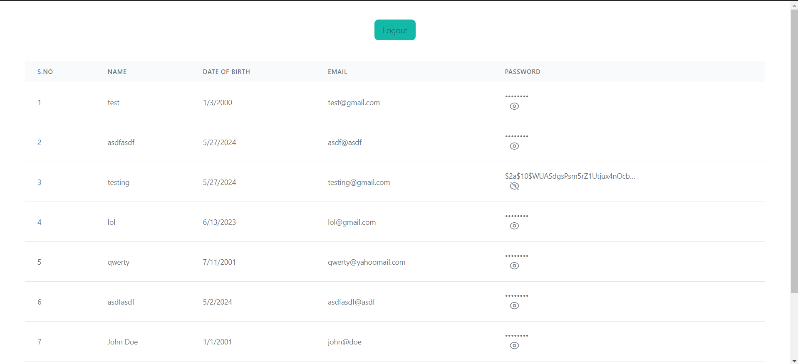

# react-node-test

## Screenshot




## Installing react-node-test

1. Clone the repository:
   ```
   git clone git@github.com:ShlokBharadwaj/react-node-test.git
   ```
2. Navigate to server directory:
   ```
   cd react-node-test/server
   ```
3. Install dependencies:
   ```
    npm i
    ```
4. Start the server:
   ```
   nodemon start
   ```
5. Open another terminal window and navigate to the client directory:
    ```
    cd ../client
    ```
6. Install dependencies:
    ```
    npm i
    ```
7. Start the client:
    ```
    npm run dev
    ```
8. Open [http://localhost:5173](http://localhost:5173) to view the frontend in the browser.

9. Open [http://localhost:5000](http://localhost:5000) to view the backend in the browser.

## Using Picster

To run the application on your local machine, follow these steps:

<!-- Create a .env files with keys, take .env.sample for reference-->

1. Go to the root of the client and server directory and create a `.env` file.

```
touch .env
```

2. Navigate to `.env.example` and copy the contents to `.env`.

```
cp .env.example .env
```

3. Replace the values of the keys with your own values.

*Hint*: _Follow the directions in the `.env.example` to know what values to change and where to find those values._

## License

This project is licensed under the MIT License - see the [LICENSE](./LICENSE) file for details.